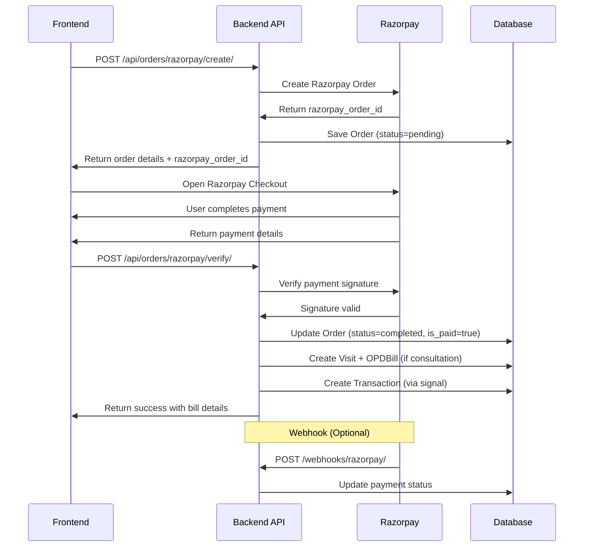

# Razorpay Payment Gateway - Frontend API Documentation

**Version**: 1.0
**Last Updated**: 2025-12-26
**Author**: DigiHMS Development Team

---

## Table of Contents

1. [Overview](#overview)
2. [Payment Flow](#payment-flow)
3. [New API Endpoints](#new-api-endpoints)
4. [Updated Endpoints](#updated-endpoints)
5. [Payment Method Enum Updates](#payment-method-enum-updates)
6. [Frontend Integration Guide](#frontend-integration-guide)
7. [Error Handling](#error-handling)
8. [Testing Guide](#testing-guide)

---

## Overview

The Razorpay payment gateway integration enables online payments for all DigiHMS services including:
- **Consultation** - Doctor appointments
- **Diagnostic** - Diagnostic services
- **Laboratory** - Lab tests
- **Pharmacy** - Medicine orders
- **Nursing Care** - Nursing services
- **Home Healthcare** - Home healthcare services

### Key Features
✅ Secure payment processing via Razorpay
✅ Automatic OPD bill generation for consultation orders
✅ Transaction tracking in payments module
✅ Support for all service types
✅ Payment verification with signature validation
✅ Webhook support for real-time payment updates

---

## Payment Flow



---

## New API Endpoints

### 1. Create Razorpay Order

**Endpoint**: `POST /api/orders/razorpay/create/`

**Description**: Creates an order in DigiHMS and Razorpay, returns checkout details for frontend

**Authentication**: Required (Bearer Token)

**Request Body**:
```json
{
  "patient_id": 123,
  "services_type": "consultation",
  "appointment_id": 456,
  "items": [
    {
      "service_id": 456,
      "content_type": "appointment",
      "quantity": 1
    }
  ],
  "fees": [
    {
      "fee_type_id": 5,
      "amount": 50.00
    }
  ],
  "notes": "Online consultation payment"
}
```

**Request Fields**:

| Field | Type | Required | Description |
|-------|------|----------|-------------|
| `patient_id` | integer | ✅ Yes | Patient profile ID |
| `services_type` | string (enum) | ✅ Yes | One of: `consultation`, `diagnostic`, `laboratory`, `pharmacy`, `nursing_care`, `home_healthcare` |
| `appointment_id` | integer | ⚠️ Conditional | **Required** if `services_type` is `consultation` |
| `items` | array | ✅ Yes | Array of service items (minimum 1 item) |
| `items[].service_id` | integer | ✅ Yes | ID of the service (Appointment ID for consultations) |
| `items[].content_type` | string | ✅ Yes | Model type (e.g., `appointment`, `diagnosticorder`) |
| `items[].quantity` | integer | ✅ Yes | Quantity (usually 1 for appointments) |
| `fees` | array | ❌ No | Additional fees (optional) |
| `fees[].fee_type_id` | integer | ✅ Yes | Fee type ID from `/api/orders/fee-types/` |
| `fees[].amount` | decimal | ❌ No | Amount (auto-calculated if fee is percentage-based) |
| `notes` | string | ❌ No | Additional order notes |

**Success Response** (`201 Created`):
```json
{
  "success": true,
  "message": "Order created successfully",
  "data": {
    "order_id": "550e8400-e29b-41d4-a716-446655440000",
    "order_number": "ORD20250001",
    "razorpay_order_id": "order_NhRxpQXqBpJz2K",
    "razorpay_key_id": "rzp_test_xxxxxxxxxxxxx",
    "amount": 500.00,
    "currency": "INR",
    "patient_name": "John Doe",
    "patient_email": "john@example.com",
    "patient_mobile": "9876543210"
  }
}
```

**Response Fields**:

| Field | Type | Description |
|-------|------|-------------|
| `order_id` | UUID | DigiHMS order ID (save for verification) |
| `order_number` | string | Human-readable order number |
| `razorpay_order_id` | string | Razorpay order ID (use in checkout) |
| `razorpay_key_id` | string | Public Razorpay key for checkout |
| `amount` | float | Total amount in rupees |
| `currency` | string | Currency code (INR) |
| `patient_name` | string | Patient full name |
| `patient_email` | string | Patient email |
| `patient_mobile` | string | Patient mobile number |

**Error Responses**:

```json
// 400 Bad Request - Validation Error
{
  "success": false,
  "error": "appointment_id: Required for consultation orders"
}

// 400 Bad Request - Razorpay Not Configured
{
  "success": false,
  "error": "Razorpay not configured for tenant <tenant_id>"
}

// 401 Unauthorized
{
  "error": "Authorization header required"
}
```

---

### 2. Verify Razorpay Payment

**Endpoint**: `POST /api/orders/razorpay/verify/`

**Description**: Verifies payment signature and completes the order. For consultation orders, auto-creates Visit + OPDBill.

**Authentication**: Required (Bearer Token)

**Request Body**:
```json
{
  "order_id": "550e8400-e29b-41d4-a716-446655440000",
  "razorpay_order_id": "order_NhRxpQXqBpJz2K",
  "razorpay_payment_id": "pay_NhRxpQXqBpJz2L",
  "razorpay_signature": "9ef4dffbfd84f1318f6739a3ce19f9d85851857ae648f114332d8401e0949a3d"
}
```

**Request Fields**:

| Field | Type | Required | Description |
|-------|------|----------|-------------|
| `order_id` | UUID | ✅ Yes | DigiHMS order ID (from create response) |
| `razorpay_order_id` | string | ✅ Yes | Razorpay order ID |
| `razorpay_payment_id` | string | ✅ Yes | Razorpay payment ID (from checkout success) |
| `razorpay_signature` | string | ✅ Yes | Razorpay signature (from checkout success) |

**Success Response** (`200 OK`):

**For Non-Consultation Orders**:
```json
{
  "success": true,
  "message": "Payment verified successfully",
  "data": {
    "order_id": "550e8400-e29b-41d4-a716-446655440000",
    "order_number": "ORD20250001",
    "status": "completed",
    "is_paid": true
  }
}
```

**For Consultation Orders** (includes OPD bill details):
```json
{
  "success": true,
  "message": "Payment verified successfully",
  "data": {
    "order_id": "550e8400-e29b-41d4-a716-446655440000",
    "order_number": "ORD20250001",
    "status": "completed",
    "is_paid": true,
    "visit_id": 789,
    "visit_number": "OPD/20250101/001",
    "opd_bill_id": 123,
    "bill_number": "OPD-BILL/20250101/001"
  }
}
```

**Error Responses**:

```json
// 400 Bad Request - Invalid Signature
{
  "success": false,
  "error": "Invalid payment signature"
}

// 400 Bad Request - Already Paid
{
  "success": false,
  "error": "Order already paid"
}

// 404 Not Found
{
  "success": false,
  "error": "Order not found"
}
```

---

## Updated Endpoints

### 1. Get Fee Types

**Endpoint**: `GET /api/orders/fee-types/`

**No Changes** - Endpoint remains the same

**Response**:
```json
{
  "success": true,
  "data": [
    {
      "id": 1,
      "name": "Service Charge",
      "code": "SERVICE_FEE",
      "category": "service",
      "is_percentage": false,
      "value": "50.00",
      "description": "Standard service fee"
    },
    {
      "id": 2,
      "name": "GST",
      "code": "GST",
      "category": "tax",
      "is_percentage": true,
      "value": "18.00",
      "description": "Goods and Services Tax"
    }
  ]
}
```

---

### 2. List Orders

**Endpoint**: `GET /api/orders/`

**Updated Response** - New fields added:

```json
{
  "success": true,
  "data": [
    {
      "id": "550e8400-e29b-41d4-a716-446655440000",
      "order_number": "ORD20250001",
      "patient_name": "John Doe",
      "services_type": "consultation",
      "status": "completed",
      "payment_method": "razorpay",
      "is_paid": true,
      "total_amount": "500.00",
      "created_at": "2025-01-15T10:30:00Z"
    }
  ]
}
```

**New Filter Parameters**:

| Parameter | Type | Description |
|-----------|------|-------------|
| `payment_verified` | boolean | Filter by payment verification status |

---

### 3. Get Order Details

**Endpoint**: `GET /api/orders/{order_id}/`

**Updated Response** - New fields in response:

```json
{
  "id": "550e8400-e29b-41d4-a716-446655440000",
  "order_number": "ORD20250001",
  "patient": "John Doe",
  "appointment": 456,
  "services_type": "consultation",
  "status": "completed",
  "payment_method": "razorpay",
  "is_paid": true,
  "subtotal": "450.00",
  "total_fees": "50.00",
  "total_amount": "500.00",
  "notes": "Online consultation",
  "created_at": "2025-01-15T10:30:00Z",
  "updated_at": "2025-01-15T10:35:00Z",
  "order_items": [
    {
      "id": 1,
      "service_type": "appointment",
      "service_details": {
        "id": 456,
        "appointment_id": "APT20250001",
        "doctor_name": "Dr. Jane Smith",
        "appointment_type": "Consultation",
        "consultation_fee": "450.00"
      },
      "quantity": 1,
      "total_price": "450.00"
    }
  ],
  "order_fees": [
    {
      "fee_type": {
        "id": 1,
        "name": "Service Charge",
        "code": "SERVICE_FEE",
        "category": "service",
        "is_percentage": false,
        "value": "50.00"
      },
      "amount": "50.00"
    }
  ]
}
```

**New Fields**:

| Field | Type | Description |
|-------|------|-------------|
| `appointment` | integer | Appointment ID (for consultation orders) |

---

## Payment Method Enum Updates

All payment method fields now include `'razorpay'` option.

### Updated Payment Method Values

**Available in**:
- `Order.payment_method`
- `OPDBill.payment_mode`
- `Transaction.payment_method`

**Enum Values**:
```typescript
type PaymentMethod =
  | 'cash'
  | 'card'
  | 'upi'
  | 'net_banking'
  | 'online'
  | 'razorpay'      // ← NEW
  | 'insurance'
  | 'cheque'
  | 'other';
```

### Usage Example

```typescript
// When displaying payment method
const paymentMethodLabels = {
  cash: 'Cash',
  card: 'Card',
  upi: 'UPI',
  net_banking: 'Net Banking',
  online: 'Online Payment',
  razorpay: 'Razorpay',
  insurance: 'Insurance',
  cheque: 'Cheque',
  other: 'Other'
};
```

---

## Frontend Integration Guide

### Step 1: Install Razorpay SDK

Add Razorpay checkout script to your HTML:

```html
<script src="https://checkout.razorpay.com/v1/checkout.js"></script>
```

Or install via npm (for React/Vue/Angular):

```bash
npm install razorpay
```

---

### Step 2: Create Payment Function

**React/Next.js Example**:

```typescript
import { useState } from 'react';

interface RazorpayOptions {
  key: string;
  amount: number;
  currency: string;
  name: string;
  description: string;
  order_id: string;
  prefill: {
    name: string;
    email: string;
    contact: string;
  };
  theme: {
    color: string;
  };
  handler: (response: any) => void;
  modal: {
    ondismiss: () => void;
  };
}

const PaymentComponent = () => {
  const [loading, setLoading] = useState(false);

  const handlePayment = async (appointmentId: number, patientId: number) => {
    try {
      setLoading(true);

      // Step 1: Create Razorpay Order
      const createResponse = await fetch('/api/orders/razorpay/create/', {
        method: 'POST',
        headers: {
          'Authorization': `Bearer ${authToken}`,
          'Content-Type': 'application/json',
        },
        body: JSON.stringify({
          patient_id: patientId,
          services_type: 'consultation',
          appointment_id: appointmentId,
          items: [
            {
              service_id: appointmentId,
              content_type: 'appointment',
              quantity: 1
            }
          ],
          notes: 'Online consultation payment'
        })
      });

      const createData = await createResponse.json();

      if (!createData.success) {
        throw new Error(createData.error);
      }

      // Step 2: Open Razorpay Checkout
      const options: RazorpayOptions = {
        key: createData.data.razorpay_key_id,
        amount: createData.data.amount * 100, // Convert to paise
        currency: createData.data.currency,
        name: 'DigiHMS',
        description: 'Hospital Services Payment',
        order_id: createData.data.razorpay_order_id,
        prefill: {
          name: createData.data.patient_name,
          email: createData.data.patient_email,
          contact: createData.data.patient_mobile
        },
        theme: {
          color: '#3399cc'
        },
        handler: async (response) => {
          // Step 3: Verify Payment
          await verifyPayment(
            createData.data.order_id,
            response.razorpay_order_id,
            response.razorpay_payment_id,
            response.razorpay_signature
          );
        },
        modal: {
          ondismiss: () => {
            console.log('Payment cancelled by user');
            setLoading(false);
          }
        }
      };

      const razorpay = new (window as any).Razorpay(options);
      razorpay.open();

    } catch (error) {
      console.error('Payment error:', error);
      alert('Payment failed: ' + error.message);
      setLoading(false);
    }
  };

  const verifyPayment = async (
    orderId: string,
    razorpayOrderId: string,
    razorpayPaymentId: string,
    razorpaySignature: string
  ) => {
    try {
      const verifyResponse = await fetch('/api/orders/razorpay/verify/', {
        method: 'POST',
        headers: {
          'Authorization': `Bearer ${authToken}`,
          'Content-Type': 'application/json',
        },
        body: JSON.stringify({
          order_id: orderId,
          razorpay_order_id: razorpayOrderId,
          razorpay_payment_id: razorpayPaymentId,
          razorpay_signature: razorpaySignature
        })
      });

      const verifyData = await verifyResponse.json();

      if (verifyData.success) {
        // Payment successful
        alert('Payment successful!');
        console.log('Order details:', verifyData.data);

        // Redirect to success page
        if (verifyData.data.visit_number) {
          // For consultation orders
          window.location.href = `/opd/visits/${verifyData.data.visit_id}`;
        } else {
          window.location.href = `/orders/${verifyData.data.order_id}/success`;
        }
      } else {
        throw new Error(verifyData.error);
      }

    } catch (error) {
      console.error('Verification error:', error);
      alert('Payment verification failed: ' + error.message);
    } finally {
      setLoading(false);
    }
  };

  return (
    <button
      onClick={() => handlePayment(456, 123)}
      disabled={loading}
    >
      {loading ? 'Processing...' : 'Pay Now'}
    </button>
  );
};
```

---

### Step 3: Vue.js Example

```vue
<template>
  <button @click="handlePayment" :disabled="loading">
    {{ loading ? 'Processing...' : 'Pay Now' }}
  </button>
</template>

<script>
export default {
  data() {
    return {
      loading: false
    };
  },
  methods: {
    async handlePayment() {
      try {
        this.loading = true;

        // Step 1: Create Order
        const createResponse = await this.$axios.post('/api/orders/razorpay/create/', {
          patient_id: this.patientId,
          services_type: 'consultation',
          appointment_id: this.appointmentId,
          items: [{
            service_id: this.appointmentId,
            content_type: 'appointment',
            quantity: 1
          }]
        });

        const { data } = createResponse.data;

        // Step 2: Open Razorpay
        const options = {
          key: data.razorpay_key_id,
          amount: data.amount * 100,
          currency: data.currency,
          name: 'DigiHMS',
          description: 'Hospital Services',
          order_id: data.razorpay_order_id,
          prefill: {
            name: data.patient_name,
            email: data.patient_email,
            contact: data.patient_mobile
          },
          handler: async (response) => {
            await this.verifyPayment(data.order_id, response);
          }
        };

        const razorpay = new window.Razorpay(options);
        razorpay.open();

      } catch (error) {
        this.$toast.error('Payment failed: ' + error.message);
      } finally {
        this.loading = false;
      }
    },

    async verifyPayment(orderId, razorpayResponse) {
      const response = await this.$axios.post('/api/orders/razorpay/verify/', {
        order_id: orderId,
        razorpay_order_id: razorpayResponse.razorpay_order_id,
        razorpay_payment_id: razorpayResponse.razorpay_payment_id,
        razorpay_signature: razorpayResponse.razorpay_signature
      });

      if (response.data.success) {
        this.$toast.success('Payment successful!');
        this.$router.push(`/orders/${orderId}/success`);
      }
    }
  }
};
</script>
```

---

### Step 4: Angular Example

```typescript
import { Component } from '@angular/core';
import { HttpClient } from '@angular/common/http';

declare var Razorpay: any;

@Component({
  selector: 'app-payment',
  templateUrl: './payment.component.html'
})
export class PaymentComponent {
  loading = false;

  constructor(private http: HttpClient) {}

  async handlePayment() {
    this.loading = true;

    try {
      // Create Order
      const createResponse: any = await this.http.post('/api/orders/razorpay/create/', {
        patient_id: this.patientId,
        services_type: 'consultation',
        appointment_id: this.appointmentId,
        items: [{
          service_id: this.appointmentId,
          content_type: 'appointment',
          quantity: 1
        }]
      }).toPromise();

      const { data } = createResponse;

      // Open Razorpay
      const options = {
        key: data.razorpay_key_id,
        amount: data.amount * 100,
        currency: data.currency,
        name: 'DigiHMS',
        order_id: data.razorpay_order_id,
        handler: (response: any) => {
          this.verifyPayment(data.order_id, response);
        }
      };

      const razorpay = new Razorpay(options);
      razorpay.open();

    } catch (error) {
      alert('Payment failed');
    }
  }

  async verifyPayment(orderId: string, razorpayResponse: any) {
    const response: any = await this.http.post('/api/orders/razorpay/verify/', {
      order_id: orderId,
      razorpay_order_id: razorpayResponse.razorpay_order_id,
      razorpay_payment_id: razorpayResponse.razorpay_payment_id,
      razorpay_signature: razorpayResponse.razorpay_signature
    }).toPromise();

    if (response.success) {
      alert('Payment successful!');
    }
  }
}
```

---

## Error Handling

### Common Error Scenarios

#### 1. Order Creation Failed

```typescript
// Error Response
{
  "success": false,
  "error": "Razorpay not configured for tenant <tenant_id>"
}

// Handling
if (!response.success) {
  if (response.error.includes('not configured')) {
    alert('Payment system is not available. Please contact support.');
  } else {
    alert('Failed to create order: ' + response.error);
  }
}
```

#### 2. Payment Verification Failed

```typescript
// Error Response
{
  "success": false,
  "error": "Invalid payment signature"
}

// Handling
if (!verifyResponse.success) {
  if (verifyResponse.error.includes('signature')) {
    alert('Payment verification failed. Please contact support with your payment ID.');
  } else if (verifyResponse.error.includes('already paid')) {
    alert('This order has already been paid.');
  }
}
```

#### 3. User Cancelled Payment

```typescript
// Razorpay modal ondismiss callback
modal: {
  ondismiss: () => {
    console.log('User cancelled payment');
    // Optional: Show cancellation message
    // Optional: Delete pending order
  }
}
```

#### 4. Network Errors

```typescript
try {
  const response = await fetch('/api/orders/razorpay/create/', {...});
} catch (error) {
  if (error instanceof TypeError) {
    alert('Network error. Please check your internet connection.');
  } else {
    alert('An error occurred: ' + error.message);
  }
}
```

---

## Testing Guide

### Test Mode Setup

1. Use test credentials from Razorpay Dashboard
2. Set `RAZORPAY_TEST_MODE=True` in backend `.env`
3. Use test card details for payment

### Test Card Details

```
Card Number: 4111 1111 1111 1111
CVV: Any 3 digits
Expiry: Any future date
Name: Any name
```

### Test Payment Scenarios

#### Successful Payment
```typescript
// Create order → Pay → Verify
const orderId = await createRazorpayOrder({...});
// Use test card
// Payment succeeds
await verifyPayment({...});
// Check: Order status = 'completed', is_paid = true
```

#### Failed Payment
```typescript
// Create order → Cancel payment
const orderId = await createRazorpayOrder({...});
// Click outside Razorpay modal to cancel
// Check: Order status remains 'pending'
```

#### Consultation Order with OPD Bill
```typescript
// Create consultation order with appointment_id
const response = await verifyPayment({...});
// Check response includes:
// - visit_id
// - visit_number
// - opd_bill_id
// - bill_number
```

---

## TypeScript Interfaces

```typescript
// Request Interfaces
interface CreateRazorpayOrderRequest {
  patient_id: number;
  services_type: 'consultation' | 'diagnostic' | 'laboratory' | 'pharmacy' | 'nursing_care' | 'home_healthcare';
  appointment_id?: number;
  items: {
    service_id: number;
    content_type: string;
    quantity: number;
  }[];
  fees?: {
    fee_type_id: number;
    amount?: number;
  }[];
  notes?: string;
}

interface VerifyRazorpayPaymentRequest {
  order_id: string;
  razorpay_order_id: string;
  razorpay_payment_id: string;
  razorpay_signature: string;
}

// Response Interfaces
interface CreateRazorpayOrderResponse {
  success: boolean;
  message: string;
  data: {
    order_id: string;
    order_number: string;
    razorpay_order_id: string;
    razorpay_key_id: string;
    amount: number;
    currency: string;
    patient_name: string;
    patient_email: string;
    patient_mobile: string;
  };
}

interface VerifyRazorpayPaymentResponse {
  success: boolean;
  message: string;
  data: {
    order_id: string;
    order_number: string;
    status: string;
    is_paid: boolean;
    visit_id?: number;
    visit_number?: string;
    opd_bill_id?: number;
    bill_number?: string;
  };
}

interface ErrorResponse {
  success: false;
  error: string;
}
```

---

## Quick Reference

### API Endpoints Summary

| Method | Endpoint | Description |
|--------|----------|-------------|
| `POST` | `/api/orders/razorpay/create/` | Create order & get Razorpay details |
| `POST` | `/api/orders/razorpay/verify/` | Verify payment signature |
| `GET` | `/api/orders/fee-types/` | Get available fee types |
| `GET` | `/api/orders/` | List all orders |
| `GET` | `/api/orders/{id}/` | Get order details |

### Required Headers

```typescript
{
  'Authorization': 'Bearer <jwt_token>',
  'Content-Type': 'application/json'
}
```

### Service Types

- `consultation` - Doctor consultations
- `diagnostic` - Diagnostic services
- `laboratory` - Lab tests
- `pharmacy` - Pharmacy orders
- `nursing_care` - Nursing services
- `home_healthcare` - Home healthcare

### Payment Status Flow

```
pending → completed (on successful payment)
pending → cancelled (on payment failure/cancellation)
```

---

## Support & Contact

For any issues or questions:
- **Backend API Issues**: Contact backend team
- **Razorpay Integration**: Check [Razorpay Docs](https://razorpay.com/docs/)
- **Payment Issues**: Contact hospital admin

---

**End of Documentation**
